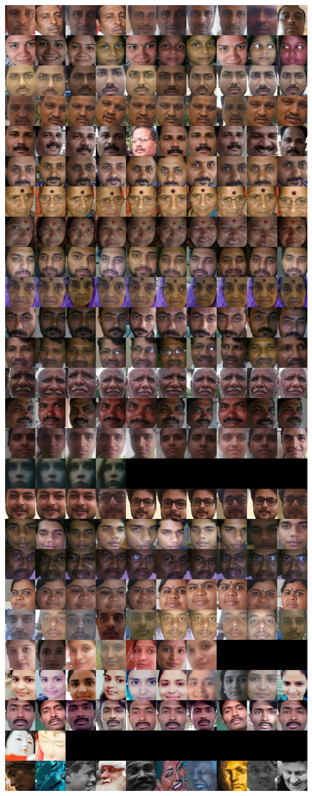
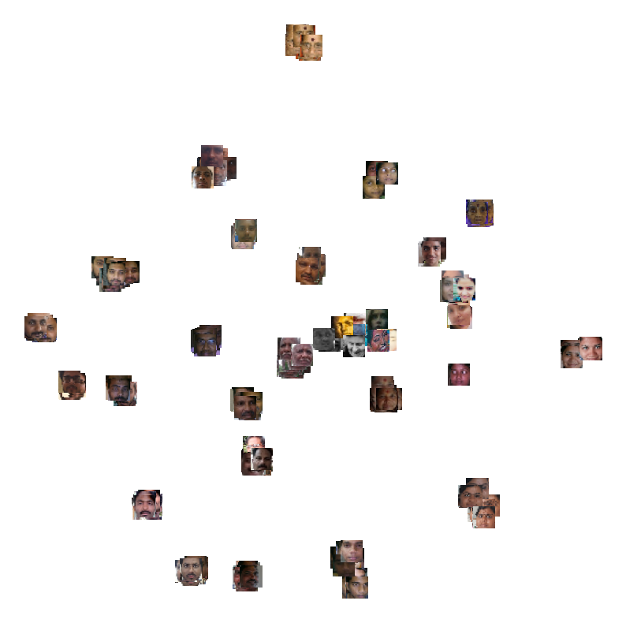

# Persons unsupervised recognition via clusterization

## 1. Create encodings

```
python calc_encodings.py --dataset=data/clusters --encodings=encodings.json
```

## 2. Run clustirization

Run demo.ipynb



